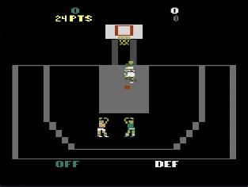

<a id="readme-top"></a>

<!-- Project Header -->
<br />
<div align="center">

<h3 align="center">AI Hoops!</h3>
  
  <p align="center">
    Create agents to play Double Dunk.
  </p>
</div>

<!-- TABLE OF CONTENTS -->
<details>
  <summary>Table of Contents</summary>
  <ol>
    <li>
      <a href="#about-ai-hoops">About AI Hoops</a>
    </li>
    <li>
      <a href="#getting-started">Getting Started</a>
      <li><a href="#installation">Installation</a></li>
    </li>
    <li><a href="#usage">Usage</a></li>
    <li><a href="#contact">Contact</a></li>
    <li><a href="#acknowledgments">Acknowledgments</a></li>
  </ol>
</details>

<!-- ABOUT THE PROJECT -->
## About AI Hoops

AI Hoops is a respository for training and executing models on the Dobble Dunk Atari Enviroment. It supports both single and multi-agent enviroments. It provides an api to easily train the model architecture on various hyperparamaters. It may be useful on other Atari Enviroments too.

<p align="right">(<a href="#readme-top">back to top</a>)</p>

<!-- GETTING STARTED -->
## Getting Started

### Installation

<p align="right">(<a href="#readme-top">back to top</a>)</p>

Install the following prerequisites. Be sure to have auto rom install roms for both Gymnasium and PettingZoo if you want to use both.
<ul>
  <li><a href="https://github.com/pytorch/pytorch">Pytorch</a></li>
  <li><a href="https://github.com/Farama-Foundation/Gymnasium">Gymnasium</a></li>
  <li><a href="https://github.com/Farama-Foundation/PettingZoo">PettingZoo</a></li>
  <li><a href="https://github.com/Farama-Foundation/Arcade-Learning-Environment">Arcade-Learning-Environment</a></li>
  <li><a href="https://github.com/Farama-Foundation/AutoROM">AutoROM</a></li>
  <li><a href="#installation">Installation</a></li>
</ul>

or, use the `requirements.txt` we provide by doing:
```
pip3 install -r requirements.txt
```
Note: This installs everything except Torch, since in order to install Torch with CUDA you have to follow the [instructions](https://pytorch.org/get-started/locally/) on the PyTorch website.

After installing, you must execute the following command to accept the AutoROM license if you want to get the DoubleDunk ROM from Autorom (do this in a regular terminal)
```bash
AutoROM -y
```

<!-- USAGE EXAMPLES -->
## Usage

To Train the model from scratch using preset hyperparameters
```sh
   python train.py
   ```

To test the trained model and generate results:
```sh
    python test.py
   ```

To to train a multi agent model:
```sh
    python train_multi_agent.py
   ```

<p align="right">(<a href="#readme-top">back to top</a>)</p>


<!-- CONTACT -->
## Contact

Anish Sahoo - sahoo.an@northeastern.edu

Ethan Carpenter - carpenter.et@northeastern.edu

Sana Ali - ali.sa@northeastern.edu

Project Link: [https://github.com/anish-sahoo/AI-Hoops](https://github.com/anish-sahoo/AI-Hoops)

<p align="right">(<a href="#readme-top">back to top</a>)</p>


<!-- ACKNOWLEDGMENTS -->
## Acknowledgments

* [A Deeper Look at Experience Replay](https://arxiv.org/pdf/1712.01275)
* [Large Batch Experience Replay](https://proceedings.mlr.press/v162/lahire22a/lahire22a.pdf)

<p align="right">(<a href="#readme-top">back to top</a>)</p>
